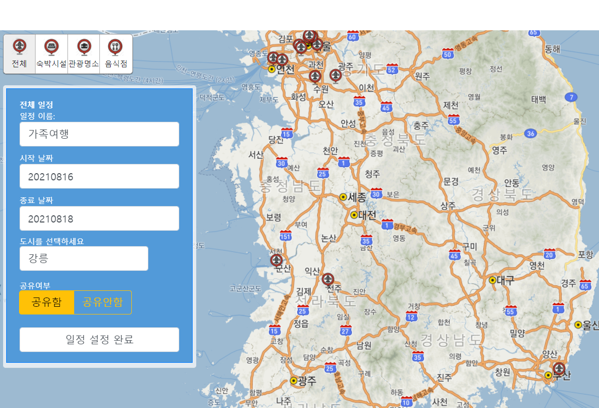
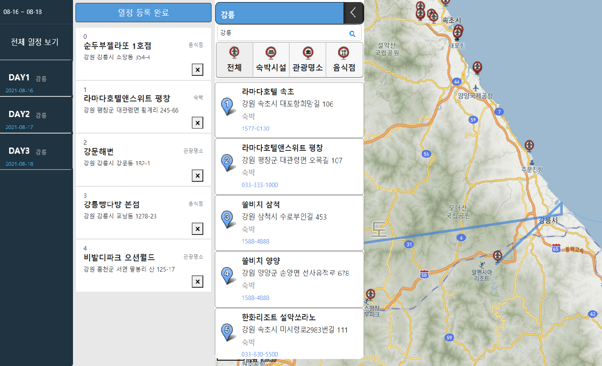
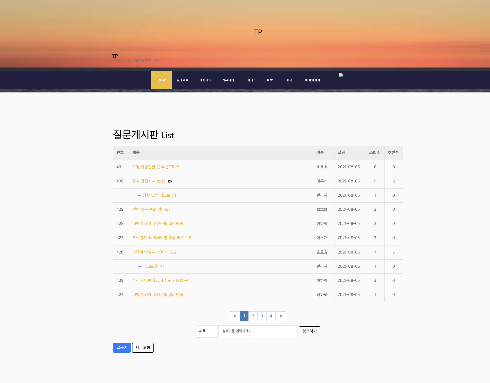
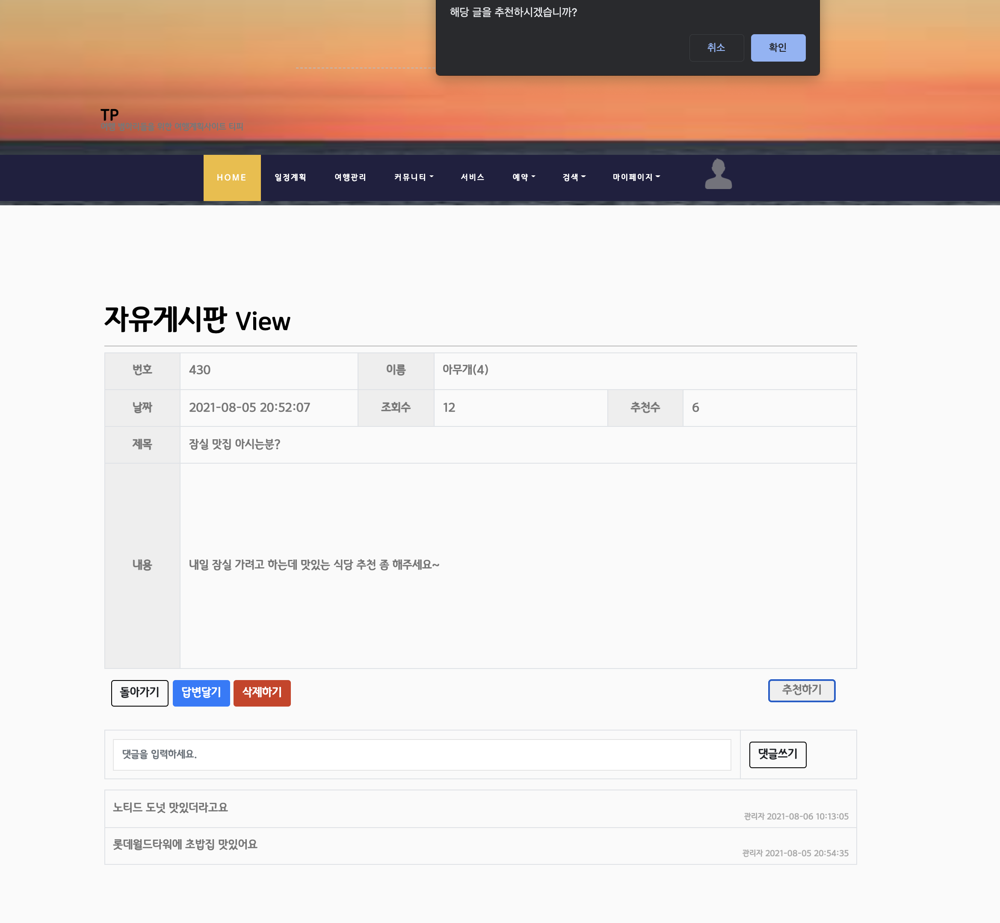
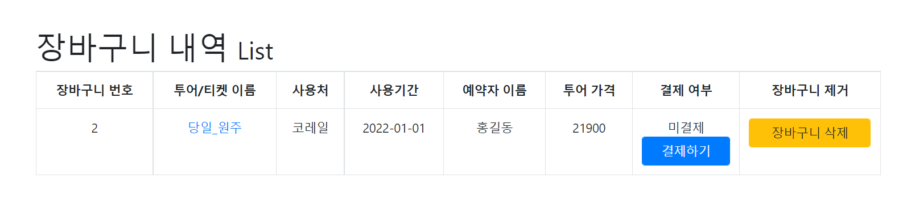
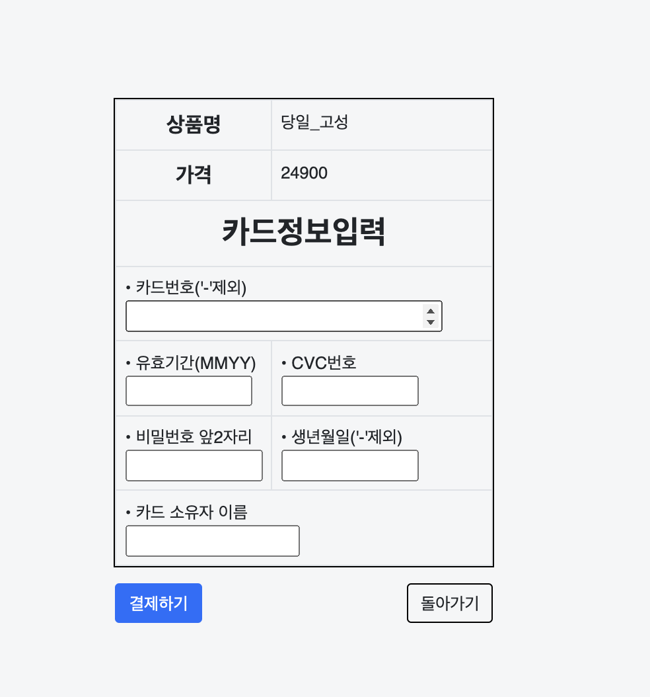

# 여행 플래너 기반 커뮤니티 사이트 TP!
## SIST Travel planner-based community site TP! 

 코로나로 인해 해외 여행자가 감소하고, 현저하게 늘어난 국내 여행 수요에 맞춰, 국내 여행 계획을 도와주는 여행 플래너를 JSP + Servlet을 활용한 MVC Model2로 제작했다 

- 여행을 위한 장소는 검색하면 얼마든지 나온다. 그렇기에 사용자의 편의성을 높인 사이트를 만들고자 하였다. 검색된 장소를 일정으로 담아 제공하는 서비스를 만들어 여행을 계획하는 사람들에게 더욱 편리한 이용이 가능하도록 하는 것이 이번 프로젝트의 주된 목표이다. 크게 음식점, 숙박업소, 명소등 세 가지의 카테고리로 나누어 카테고리별로 지도좌표에 따라 리스트를 구성하여 확인 후 일정을 계획 할 수 있다. 각 날짜 별로 일정을 계획 한 후 만들어진 일정을 공유 할 수 있고, 공유된 일정은 다른 사람이 그대로 복사 후 수정이 가능하도록 구현하였다. 자세한 일정 보기를 통해 일정 리스트를 사용자에게 제공하고 지도에 마커와 선으로 연결하여 시각적인 효과를 높여 일정에 대한 정보를 얻을 수 있다. 또한 여행이라는 특성상 여행지에 대한 경험을 나누는 것이 중요하기에 커뮤니티 게시판을 통해 사용자들이 자유롭게 의견을 나눌 수 있도록 하였다.

- 5명 구성원
- 2021.07.14 ~ 2021.08.06 까지 작업

## Features
1. 메인화면
회원가입, 로그인, 로그아웃, 일정계획, 일정관리, 커뮤니티, 검색 
2. 일정계획
일정 입력, 일정 조회, 각 일정마다 여행지 추가 및 삭제, 여행지 정보 상세보기, 여행지로 추가한 장소 지도 상 연결 및 마커 표시
3. 일정관리
일정 계획을 통해 작성된 일정 조회/삭제/수정, 일정 상세보기 
4. 커뮤니티
여행소모임 게시판, 질문 게시판, 건의 게시판, 이벤트 게시판, 자유 게시판
게시판 CRUD + 댓글 및 답글 작성/삭제 , 게시글 추천 기능 
5. 검색
장소 키워드 검색. 도시별 실시간 날씨 검색
6. 서비스 
여행 일정 의뢰 신청, 조회, 취소 
7. 예약 
투어 상품 조회, 예약 신청
8. 마이페이지
개인 정보 조회, 수정, 탈퇴
9. 장바구니 
장바구니에 담긴 상품 목록 조회, 상품 내역 상세보기 , 결제 진행  
10. 결제 및 예약 내역
결제 및 예약한 상품 조회, 관련 내역 상세보기, 예약취소 , 결제진행 

## Tech

- Java
    컬렉션
    ArrayList<T>, LinkedList<T>, HashMap<T>, Comparator 등
    오버로딩, 오버라이딩

-DBMS
Oracle Procedure, View 등 SQL DML, DDL

-JDBC
Connection, PreparedStatement, ResultSet

-HTML5, CSS, JavaScript
HTML, CSS, JavaScript 응용

-JSP
JSTL 문법, EL문법

-Servlet
가상주소, Dispatcher, request, response 등

-Bootstrap5
layout, content, forms, icon 등

-Jquery
Ajax 기능 구현에 필요한 메소드 등 

-Jquery-UI
Calander, Draggable, Sorttable

-JSTL
서블릿에서 받은 정보를 jsp에서 출력하기 위함.

-Kakao API
지도API 

-Javascript
카카오 API 호출 후 JavaSciprt로 재가공, 데이터 정제, 데이터 계산, 데이터 출력

    

## Review
  
## implementation screen 
  </img>
  </img>
  </img>
  </img>
  </img>
  </img>
  </img>
        

